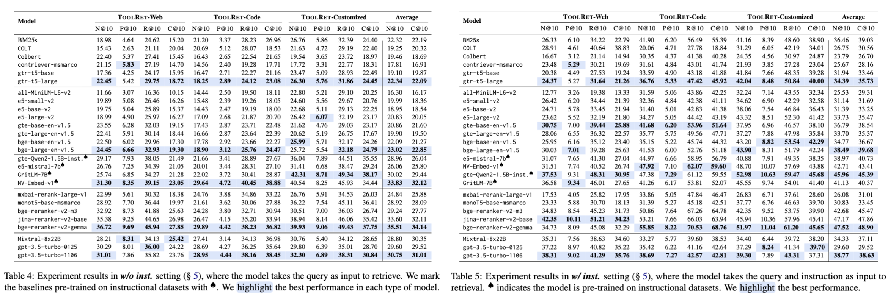

<div align="center">
   <h1>ToolRet 🔍</h1>
</div>

🔧 Retrieving useful tools from a large-scale toolset is an important step for Large language model (LLMs) in tool learning. This project (AutoTools) contribute to (i) _the first comprehensive tool retrieval benchmark_ to systematically evaluate existing information retrieval (IR) models on tool retrieval tasks; and (ii) a large-scale training dataset to optimize the expertise of IR models on this tool retrieval task.


## News

- **[2025.1.20]** Our [paper]() is submitted in arxiv! See our [paper]() for details.
- **[2024. 12.7 ]** The blog for our work can be accessed by clicking this [link](https://mangopy.github.io/tool-retrieval-benchmark/). 
- **[2024. 12.7 ]** Our code is released on [Github](https://github.com/mangopy/tool-retrieval-benchmark/) and the dataset is released on HuggingFace([Toolset](https://huggingface.co/datasets/mangopy/ToolRet-Tools) and [Queries](https://huggingface.co/datasets/mangopy/ToolRet-Queries)). Please click the link for more details. 


## A New Benchmark -- ToolRet
A concrete example for our evaluation dataset.
```json
{
    "id": "apigen_query_5",
    "query": "Given an initial population of 500 bacteria with a growth rate of 0.3 per minute and a doubling time of 20 minutes, what will be the population after 45 minutes?",
    "labels": [
        {
            "id": "apigen_tool_272",
            "doc": {
                "name": "bacterial_growth",
                "description": "Calculates the bacterial population after a given time based on the initial population and growth rate.",
                "parameters": {
                    "initial_population": {
                        "description": "The initial bacterial population.",
                        "type": "int",
                        "default": 20
                    },
                    "growth_rate": {
                        "description": "The growth rate per unit time.",
                        "type": "float",
                        "default": 20
                    },
                    "time": {
                        "description": "The time elapsed.",
                        "type": "float"
                    },
                    "doubling_time": {
                        "description": "The doubling time of the bacteria in minutes. Defaults to 20.",
                        "type": "float, optional"
                    }
                }
            },
            "relevance": 1
        }
    ],
    "instruction": "Given a `bacterial population prediction` task, retrieve tools that calculate population growth by processing parameters such as initial population, growth rate, elapsed time, and doubling time to provide the projected population size."
}
```

> The full evaluation dataset has been released. See the following `Resource` part for details.

## Python Environment
```shell
conda env create -f requirements.yml
```

## Evaluation

### Quick start
In this work, we systematically evaluate a wide range of advanced IR models.
Below, we show an example for evaluation, where we evaluate the embedding model `intfloat/e5-small-v2`.

```python
# evaluate embedding models
from toolret.eval import eval_retrieval
from toolret.config import _MODEL, _TASK
import os


model = 'intfloat/e5-small-v2' # _MODEL[0]
task = ['all']
output_file = ','.join(task)+'.json'
results = eval_retrieval(model_name=model,
                        tasks=task,
                        category='all',
                        output_file=output_file,
                        is_inst=True)
print(results)
```

The code can be also found in `example/embedding.py` for reference.


### Protocol for model evaluation

Our official experiment uses the following provided hyper-parameters for IR model evaluations.

| Model name         | batch size<br/> (for encode documentation or query)                                   |                               Backend APIs <br/>(to load the model)                                |
|:-------------------|:--------------------------------------------------------------------------------------|:--------------------------------------------------------------------------------------------------:|
| Bge                |                                                                                       |                                        Sentence transformer                                        |


## A Large-scale Training dataset -- ToolRet-train

A concrete example in our training dataset.
```txt
{
    "query": "Is 'https://www.apple.com' available in the Wayback Machine on September 9, 2015?",
    "pos": [
        "{'name': 'availability', 'description': 'Checks if a given URL is archived and currently accessible in the Wayback Machine.', 'parameters': {'url': {'description': 'The URL to check for availability in the Wayback Machine.', 'type': 'str', 'default': 'http://mashape.com'}, 'timestamp': {'description': \"The timestamp to look up in Wayback. If not specified, the most recent available capture is returned. The format of the timestamp is 1-14 digits (YYYYMMDDhhmmss). Defaults to '20090101'.\", 'type': 'str, optional', 'default': '20090101'}, 'callback': {'description': 'An optional callback to produce a JSONP response. Defaults to None.', 'type': 'str, optional', 'default': ''}}}"
    ],
    "neg": [
        "{'name': 'top_grossing_mac_apps', 'description': 'Fetches a list of the top-grossing Mac apps from the App Store.', 'parameters': {'category': {'description': \"The category ID for the apps to be fetched. Defaults to '6016' (general category).\", 'type': 'str', 'default': '6016'}, 'country': {'description': \"The country code for the App Store. Defaults to 'us'.\", 'type': 'str', 'default': 'us'}, 'lang': {'description': \"The language code for the results. Defaults to 'en'.\", 'type': 'str', 'default': 'en'}, 'num': {'description': 'The number of results to return. Defaults to 100. Maximum allowed value is 200.', 'type': 'int', 'default': '100'}}}",
        "{'name': 'top_paid_mac_apps', 'description': 'Retrieves a list of the top paid Mac apps from the App Store.', 'parameters': {'category': {'description': \"Category of the apps to retrieve. Default is '6016'.\", 'type': 'str', 'default': '6016'}, 'country': {'description': \"Country code to filter the app results. Default is 'us'.\", 'type': 'str', 'default': 'us'}, 'lang': {'description': \"Language code for the results. Default is 'en'.\", 'type': 'str', 'default': 'en'}, 'num': {'description': 'Number of results to return. Default is 100. Maximum is 200.', 'type': 'int', 'default': '100'}}}",
        "{'name': 'top_free_mac_apps', 'description': 'Fetches a list of the top free Mac apps from the RapidAPI App Store.', 'parameters': {'lang': {'description': \"The language for the app descriptions. Default is 'en'.\", 'type': 'str', 'default': 'en'}, 'category': {'description': \"The category ID for the apps. Default is '6016'.\", 'type': 'str', 'default': '6016'}, 'country': {'description': \"The country code for the App Store. Default is 'us'.\", 'type': 'str', 'default': 'us'}, 'num': {'description': 'The number of results to return. Default is 100. Maximum is 200.', 'type': 'int', 'default': '100'}}}",
        "{'name': 'exact_url_non_english', 'description': 'Retrieves the backlinks of a specific non-English URL using the RapidAPI service.', 'parameters': {'domain': {'description': 'The domain of the non-English URL for which to retrieve backlinks.', 'type': 'str', 'default': 'https://codeconia.com/2021/05/28/html-form-to-email-with-attachment-using-php/'}}}",
        "{'name': 'top_free_ipad_apps', 'description': 'Retrieve a list of the top free iPad apps from the App Store.', 'parameters': {'country': {'description': \"The country code for the App Store. Default is 'us'.\", 'type': 'str, optional', 'default': 'us'}, 'category': {'description': \"The category ID for the apps. Default is '6016'.\", 'type': 'str, optional', 'default': '6016'}, 'lang': {'description': \"The language code for the results. Default is 'en'.\", 'type': 'str, optional', 'default': 'en'}, 'num': {'description': 'The number of results to return. Default is 100.', 'type': 'int, optional', 'default': '100'}}}",
        "{'name': 'getproducts', 'description': 'Search for products by name and retrieves newly added items from various sources.', 'parameters': {'query': {'description': 'The search query for the products.', 'type': 'str', 'default': 'ipone 14 256Gb'}, 'page': {'description': 'The page number to retrieve.', 'type': 'int', 'default': '1'}, 'country': {'description': \"The country code to filter the search results. Defaults to 'countryUS'.\", 'type': 'str, optional', 'default': 'countryUS'}, 'location': {'description': \"The location to filter the search results. Defaults to 'us'.\", 'type': 'str, optional', 'default': 'us'}, 'lang': {'description': \"The language code to filter the search results. Defaults to 'en'.\", 'type': 'str, optional', 'default': 'en'}, 'period': {'description': 'The period in days to filter newly added items. Defaults to None.', 'type': 'int, optional', 'default': ''}}}",
        "{'name': 'historical_rates', 'description': 'Retrieves historical commodity rates for the given date, base currency, and target symbols using the Commodity Rates API.', 'parameters': {'base': {'description': 'The base currency to use for retrieving rates.', 'type': 'str', 'default': 'USD'}, 'symbols': {'description': 'The target symbols for which to retrieve rates.', 'type': 'str', 'default': 'COTTON'}, 'date': {'description': 'The historical date for the rates in the format YYYY-MM-DD.', 'type': 'str', 'default': '2022-01-19'}}}",
        "{'name': 'historical_prices', 'description': 'Fetches a list of the high and low prices for the specified item at the given time interval.', 'parameters': {'timestep': {'description': \"The interval at which to fetch price data (e.g., 'daily', 'hourly').\", 'type': 'str', 'default': '5m'}, 'itemid': {'description': 'The unique identifier for the item.', 'type': 'int', 'default': '565'}}}",
        "{'name': 'v1_historicalevents', 'description': 'Fetches a list of up to 10 historical events that match the provided search parameters using API Ninjas Historical Events API.', 'parameters': {'text': {'description': \"Query text to search events by. Use keywords or short phrases for best match results. Defaults to 'roman empire'.\", 'type': 'str', 'default': 'roman empire'}, 'month': {'description': 'Integer representing the month (e.g., 3 for March). Defaults to None.', 'type': 'int, optional', 'default': ''}, 'day': {'description': 'Calendar day of the month. Defaults to None.', 'type': 'int, optional', 'default': ''}, 'year': {'description': '4-digit year (e.g., 1776). For BC/BCE years, use a negative integer (e.g., -351 for 351 BC). Defaults to None.', 'type': 'int, optional', 'default': ''}, 'offset': {'description': 'Number of results to offset (for pagination). Defaults to None.', 'type': 'int, optional', 'default': ''}}}",
        "{'name': 'new_ios_apps', 'description': 'Fetch a list of new iOS apps from the App Store using the RapidAPI service.', 'parameters': {'country': {'description': \"The country code for the App Store. Defaults to 'us'.\", 'type': 'str, optional', 'default': 'us'}, 'category': {'description': \"The category code for the type of apps. Defaults to '6016'.\", 'type': 'str, optional', 'default': '6016'}, 'lang': {'description': \"The language code for the App Store content. Defaults to 'en'.\", 'type': 'str, optional', 'default': 'en'}, 'num': {'description': 'The number of results to return. Defaults to 100.', 'type': 'int, optional', 'default': '100'}}}",
        "{'name': 'capture_screenshot', 'description': 'Captures a screenshot of the specified website and returns the observation JSON or text from the API response.', 'parameters': {'url': {'description': 'The URL of the website to capture a screenshot of.', 'type': 'str', 'default': 'https://apple.com'}}}",
        "{'name': 'domain_seo_analysis', 'description': \"Fetch popular SEO metrics for a specified domain name, optionally considering the search from a specific country's perspective.\", 'parameters': {'domain': {'description': 'The domain name to analyze for SEO metrics.', 'type': 'str', 'default': 'apify.com'}, 'country': {'description': \"Specify the proxy location for the search. Supported countries include 'US', 'CA', 'IE', 'GB', 'FR', 'DE', 'SE', 'IN', 'JP', 'KR', 'SG', 'AU', 'BR'. Defaults to 'us'.\", 'type': 'str, optional', 'default': 'us'}}}",
        "{'name': 'top_paid_ios_apps', 'description': 'Fetches a list of the top paid iOS apps from the App Store.', 'parameters': {'lang': {'description': \"Language code for the results. Defaults to 'en'.\", 'type': 'str', 'default': 'en'}, 'category': {'description': \"Category ID to filter results by. Defaults to '6016'.\", 'type': 'str', 'default': '6016'}, 'country': {'description': \"Country code for the App Store to search in. Defaults to 'us'.\", 'type': 'str', 'default': 'us'}, 'num': {'description': 'Number of results to return. Defaults to 100. Maximum is 200.', 'type': 'int', 'default': '100'}}}",
        "{'name': 'gethistoricalscoresbyyear', 'description': 'Fetches historical Environmental, Social, Governance and Overall scores for companies based on the given year.', 'parameters': {'year': {'description': 'The year for which to fetch the historical scores (must be less than or equal to 2020).', 'type': 'str', 'default': '2020'}, 'content_type': {'description': 'The type of content to return. Default is None.', 'type': 'str, optional', 'default': ''}, 'sedol': {'description': 'The SEDOL identifier of the company. Default is None.', 'type': 'str, optional', 'default': ''}, 'isin': {'description': 'The ISIN identifier of the company. Default is None.', 'type': 'str, optional', 'default': ''}, 'companyname': {'description': \"The name of the company. Default is 'Apple Inc.'.\", 'type': 'str, optional', 'default': 'Apple Inc.'}}}",
        "{'name': 'products_v2_list', 'description': 'Fetches a list of products from the ASOS store with various filtering and sorting options.', 'parameters': {'store': {'description': 'The store identifier obtained from the countries/list API.', 'type': 'str', 'default': 'US'}, 'offset': {'description': 'The offset to skip already viewed products.', 'type': 'int', 'default': '0'}, 'categoryid': {'description': 'The category identifier from the categories/list API.', 'type': 'int', 'default': '4209'}, 'limit': {'description': 'The number of items per page.', 'type': 'int', 'default': '48'}, 'attribute_1046': {'description': 'Filter by style, multiple values separated by comma.', 'type': 'str, optional', 'default': ''}, 'pricemin': {'description': 'Minimum price filter.', 'type': 'int, optional', 'default': ''}, 'country': {'description': \"Country code; default is 'US'.\", 'type': 'str, optional', 'default': 'US'}, 'attribute_10147': {'description': 'Filter by leather/non-leather, multiple values separated by comma.', 'type': 'str, optional', 'default': ''}, 'sort': {'description': \"Sorting option, one of 'pricedesc', 'priceasc', or 'freshness'; default is 'freshness'.\", 'type': 'str, optional', 'default': 'freshness'}, 'q': {'description': 'Search query for products by name (do not use with categoryId).', 'type': 'str, optional', 'default': ''}, 'base_colour': {'description': 'Filter by color, multiple values separated by comma.', 'type': 'str, optional', 'default': ''}, 'range': {'description': 'Filter by sale/new season, multiple values separated by comma.', 'type': 'str, optional', 'default': ''}, 'attribute_1047': {'description': 'Filter by product type, multiple values separated by comma.', 'type': 'str, optional', 'default': ''}, 'currency': {'description': \"Currency code obtained from countries/list API; default is 'USD'.\", 'type': 'str, optional', 'default': 'USD'}, 'attribute_10155': {'description': 'Filter by range, multiple values separated by comma.', 'type': 'str, optional', 'default': ''}, 'pricemax': {'description': 'Maximum price filter.', 'type': 'int, optional', 'default': ''}, 'sizeschema': {'description': \"Size schema identifier obtained from countries/list API; default is 'US'.\", 'type': 'str, optional', 'default': 'US'}, 'brand': {'description': 'Filter by brand, multiple values separated by comma.', 'type': 'str, optional', 'default': ''}, 'size': {'description': 'Filter by size, multiple values separated by comma.', 'type': 'str, optional', 'default': ''}, 'lang': {'description': \"Language code; default is 'en-US'.\", 'type': 'str, optional', 'default': 'en-US'}}}"
    ],
    "prompt": "Given a `URL availability` task, retrieve tools that check if a given URL is archived and accessible on a specific date in the Wayback Machine."
}
```
We use the [FlagEmbedding](https://github.com/FlagOpen/FlagEmbedding/) python library to train the embedding models. To train the embedding models on our datasets, please see the `script/train.sh` for more details. The version of FlagEmbedding is `1.3.3` as provided in the `requirements.yml` file.

## 📊 Model Experiments Results
We evaluate a wide range of retrieval models on ToolRet. Our evaluation also supports two main settings, including `w/ inst.` and `w/o inst.`. The results are presented below.




## Resource

Our benchmark is built by collecting existing well-established datasets. We provide the raw collected datasets and the processed version (e.g., the ToolRet).

Our benchmark is built by collecting existing well-established datasets. We provide the raw collected datasets and the processed version (e.g., the ToolRet).

1. The raw dataset can be downloaded from the following link.

| Dataset         | Note                                                                                                                  |                                         Link                                         |
|:----------------|:----------------------------------------------------------------------------------------------------------------------|:------------------------------------------------------------------------------------:|
| Raw data        | The raw data contains all the full collected datasets (before sampling via k-means)                                   | [Huggingface dataset](https://huggingface.co/datasets/mangopy/ToolRet-before-sample) |
| ToolRet-Queries | The final evaluation benchmark, which is a subset sampled from raw dataset through k-means. (This is our v0 version.) |    [Huggingface dataset](https://huggingface.co/datasets/mangopy/ToolRet-Queries)    |
| ToolRet-Tools   | The tool retrieval corpus, which contains 43k+ tools collected from existing tool-use datasets.                       |     [Huggingface dataset](https://huggingface.co/datasets/mangopy/ToolRet-Tools)     |
| ToolRet-Train   | A large-scaling tool retrieval training datasets, which contains more than 200k tool retrieval tasks.                 | [Huggingface dataset] |

> The ToolRet-Train will be released after the peer review period.

2. The trained IR models can be downloaded from the following link

| Dataset             | Note                                                      |         Link          |
|:--------------------|:----------------------------------------------------------|:---------------------:|
| 🔥bge-large-en-v1.5 | The [bge-large-en-v1.5]() model trained on ToolRet-Train. | [Huggingface model]() |
| 🔥bge-base-en-v1.5  | The [bge-base-en-v1.5]() model trained on ToolRet-Train   | [Huggingface model]() |
| 🔥e5-large-v2       | The [e5-large-v2]() model trained on ToolRet-Train        | [Huggingface model]() |
| 🔥e5-base-v2        | The [e5-base-v2]() model trained on ToolRet-Train         | [Huggingface model]() |
 

## Acknowledgement
We sincerely thank prior work, such as [MAIR](https://github.com/sunnweiwei/MAIR/) and [ToolBench](https://github.com/OpenBMB/ToolBench), which inspire this project or provide strong technique reference.


## Citation
This work
```text
@article{ToolRetrieval,
      title    = {Retrieval Models Aren't Tool-Savvy: Benchmarking Tool Retrieval for Large Language Models},
      author   = {Zhengliang Shi, Yuhan Wang, Lingyong Yan, Pengjie Ren, Shuaiqiang Wang, Dawei Yin, Zhaochun Ren},
      year     = 2025,
      journal  = {arXiv},
}
```
Our previous work
```text
@inproceedings{autotools,
	title     = {Tool Learning in the Wild: Empowering Language Models as Automatic Tool Agents},
	author    = {Zhengliang Shi, Shen Gao, Lingyong Yan, Yue Feng, Xiuyi Chen, Zhumin Chen, Dawei Yin, Suzan Verberne, Zhaochun Ren},
	year      = 2025,
	booktitle = {WWW}
}
```

